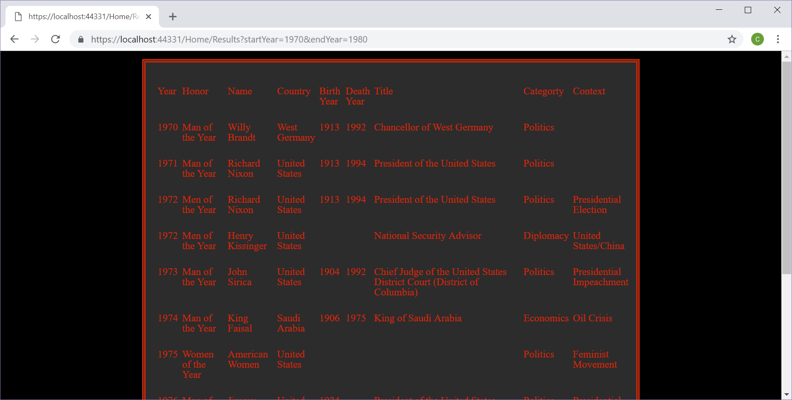

# Time Person of Year Search

## Description
Search through Time Person of the Year for a specific range of years. Uses ASP.Net and C#.

## Instructions
- Run Program
- Enter in two numbers between 1926 and 2016
- The site will take you to a results page and populate the Time Person of the Year for each year within your selected range.

## Sample 

#### Home Page

#### Results Page
